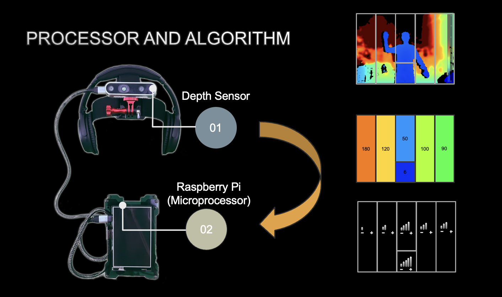

# Overview:
This project integrates depth sensing, spatial audio feedback, and real-time object detection and scene description into a single interactive device. Using an Intel RealSense depth sensor, YOLOv7 for object detection, and gTTS for text-to-speech, it provides an accessible environment for visually impaired individuals.

# Prototype Explained:
- Intel RealSense Depth Camera: connected to Raspberry Pi (Microprocessor) and mounted to the users head
- Raspberry Pi: houses the algorithm which outputs spatial audio cues and ai object detection and scene description
- Headphones: Connected to the Raspberry Pi and recieves the spatial audio cues and text to speech audio from the code

- Buttons: the up and down arrow key of a connected device are used for scene description and object detection respectively

# Code Explained:
## 1. Real Time Depth Sensing:
- Intel RealSense Depth Camera captures depth and RGB data.
- Raspberry Pi processes depth data in real-time to map different spatial zones.

## 2. Spacial Audio Feedback
- Divides the depth image into distinct zones:
	•	Far Left
	•	Left
	•	Center
	•	Far Right
	•	Right
	•	Center Down
- Each zone maps to a unique audio channel using Pygame.
- Audio volume dynamically adjusts based on the detected depth.

### Field Test Demo:
<video controls src="final field demo.mp4" title="Title"></video>

## 3. Object Detection
- Detects objects in the camera feed using the YOLOv7 Tiny model.
- Provides distance estimation for detected objects in feet and inches.
- Classifies objects from a pre-defined list.

## 4. Scene Description
- Captures images and generates natural language descriptions using the ViT-GPT2 image captioning model.
- Converts the text to speech using gTTS (Google Text-to-Speech).

## 5. User Interaction
- Up Arrow: Captures the current scene and generates an audio description.
- Down Arrow: Detects objects in the frame and describes their positions and distances.
- Once the code is started all audio cues will constantly sound and adjust to the surroundings.
- Quit: type ^c in terminal

Installation (see requirements.txt):
python==3.10.16
pyrealsense2==2.54.1
transformers==4.40.1
pygame==2.6.1
opencv-python==4.9.0
gtts==2.5.1
numpy==2.2.1
scipy==1.14.1
pillow==10.3.0
imread_from_url==0.1.7
mss==10.0.0

# Known Issues:
- MUST conda install ffmpeg
- Ensure all .wav audio files are in the music3 folder
- Use in a well lit environment for better depth detection accurracy
- Ensure the RealSense depth camera and headphones are properly connected to the Raspberry Pi. If the RealSense camera is not detected verify the connection and installation of pyrealsense2
- the YOLOv7 AI object detection and ViT-GPT2 with gTTS scene description features may take a few seconds due to the computational speed limitations of the Raspberry Pi
- YOLOv7 is a local file and takes longer to run. ViT-GPT2 uses the Hugging Face Transformers pipeline and can only be used with internet meaning it takes less time to run.

# Licence:
This project is under the MIT licence

# Contact:
If you have any questions please contact seanjiang2009@gmail.com